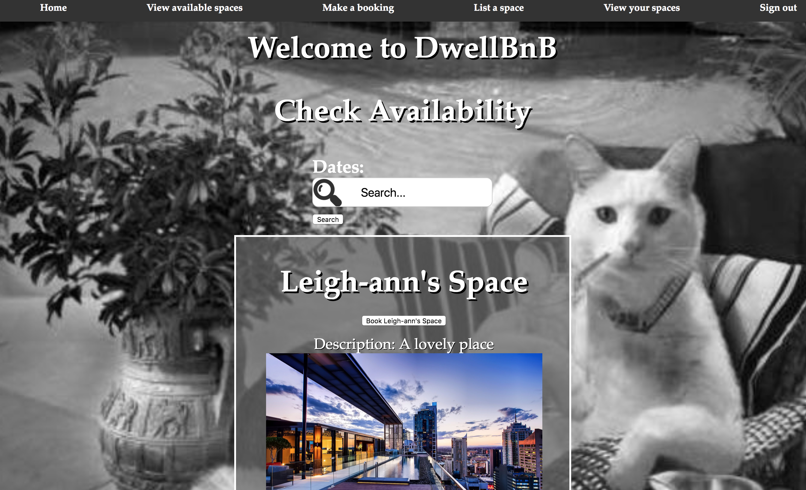

# DwellBnB

## Application Summary

DwellBnB is the online place for short-term, informal lets of surplus spaces.

It provides proprietors with a place to list their spaces, which renters can  
then choose from, with the subsequent rental transaction taking place on  
the DwellBnB platform.

## Features

* user sign up
* email confirmation upon sign in
* user sign in
* password encryption
* user sign out
* list space
* viewing all available spaces
* search by date availability
* request space
* space owner booking confirmation
* space owner booking rejection
* user payment

Listed within the README are user stories which given more time we would have wanted to implement. Given more time we would have looked into testing user payment, and added unit testing for database amendment.

### Usage

#### Getting started
* Clone https://github.com/Leigan0/makers-bnb.git
* cd makers-bnb
* Bundle
* Create two databases, dwellbnb_test and dwellbnb_development.
* rackup
* To run the email confirmation feature you need will need to provide your own api key via environment    variables called MAILGUN_API_KEY and MAILGUN_DOMAIN_NAME.

#### Tests

- Feature test focus within the project
- Unit tests included where required for Mailer model and to ensure user authentication
- To run tests run rspec from command line

## What it looks like



DwellBnB

## Technologies used

 * Ruby
 * Sinatra
 * Capybara
 * Rspec
 * Mailgun
 * Stripe
 * HTML
 * CSS
 * DataMapper

### **User Stories**

DwellBnB has been developed on the basis of the following User Stories:

##### **User Story 1 - Sign-up**

```
As a user
So I can list my space  
I want to sign up
```

##### **User Story 2 - List space**

```
As a user  
So someone can hire my space  
I want to be able to list my space
```

##### **User Story 3 - List multiple spaces**

```
As a user
So I can make money  
I want to be able to list multiple spaces
```

##### **User Story 4 - Add space information to listing**

```
As a user  
So I can make my listing appealing  
I want to be able to add a space name, description and nightly price
```

##### **User Story 5 - List space availability**

```
As a user  
So people know when my space is available  
I want to able to list the dates my space is available
```

##### **User Story 6 - Sign-in**

```
As a user  
I want to be able to sign in  
So I can hire a space
```

#####  **User Story 7 - Request a space**

```
As a user  
So I can have a space  
I want to be able to request a space
```

##### **User Story 8 - Removal of availability**

```
As a user  
So that I can review multiple requests  
I do not want availability to be removed until I have confirmed a booking
```

##### **User Story 9 - Double booked spaces**

```
As a user  
So my spaces dont get double booked  
I want availability to be removed upon booking
```

##### **User Story 10 - User persistence**

```
As a user  
So that I can log back in  
I want my user details to be saved
```

##### **User Story 11 - Password encryption**

```
As a user
So I don't need to worry about password security
I want my password to be encrypted
```

#### **_E-Mail User Stories_**

The following user stories all involve email functionality:

##### **User Story 12 - E-mail sign-up confirmation**

```
As an user  
So I know my account has been created  
I want to receive confirmation by email
```

##### **User Story 13 - E-mail listing creation confirmation**

```
As an user  
So I know my listing has been created  
I want to receive confirmation by email
```

##### **User Story 14 - E-mail listing update confimation**

```
As a user  
So that I know my listing has been updated  
I want to receive confirmation by email
```

##### **User Story 15 - E-mail notification to owner of booking request**

```
As a user
So that I know if someone has requested to book my space
I want to receive notification of that request by email
```

##### **User Story 16 - E-mail notification to owner of their acceptance of booking**

```
As a user  
So that I know my booking request has been accepted by the owner
I want to receive notification by email
```

##### **User Story 17 - E-mail notification to customer of the submission of their booking request**

```
As a user
So that I know my booking request has been submitted to the owner
I want to receive notification by email
```

##### **User Story 18 - E-mail notification to customer of owner's acceptance of their booking request**

```
As a user  
So that I know if my booking request has been accepted by the owner
I want to receive notification by email
```

##### **User Story 19 - E-mail notification to customer of denial of their booking request**

```
As a user
So that I know if my booking request has been denied
I want to receive notification by email
```


#### **_SMS User Stories_**

The following user stories all involve SMS functionality:

##### **User Story 20 - SMS notification to owner of booking request**

```
As a user
So that I know if someone has requested to book my space
I want to receive notification of that request by SMS
```

##### **User Story 21 - SMS notification to customer of owner's acceptance of their booking request**

```
As a user  
So that I know if my booking request has been accepted by the owner
I want to receive notification by SMS
```

##### **User Story 22 - SMS notification to customer of denial of their booking request**

```
As a user
So that I know if my booking request has been denied
I want to receive notification by SMS
```

#### **_Chat User Story_**

##### **User Story 23 - Chat - upon booking acceptance, a chatbox pops up for the parties to chat to each other**

```
As a user
So that I can discuss a confimed booking with the other side
I want to be able to chat to them upon acceptance
```

#### **_Payment User Stories_**

The following user stories involve payment functionality:

##### **User Story 24 - Payment - user makes paymnent via Stripe**

```
As a user
So that I can make payment for a space
I want to be able to pay through Stripe
```

##### **User Story 25 - Payment - user receives payment from user via Stripe**

```
As a user
So that I can receive payment for a space
I want to be able to accept payment through Stripe
```
